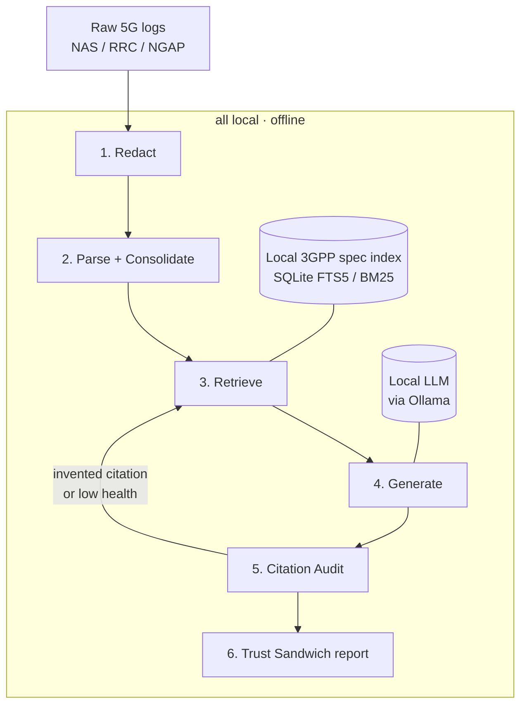

# Architecture

3GPP-RAG is a pipeline, not a single model call. Each stage has one job, and the trust
guarantees come from the *deterministic* stages and the *audit* — not from asking a model to
behave. The design goal is simple: make the 3GPP specification the source of truth, keep
everything on one machine, and prove every citation.

## 1. Redact — confidentiality first

Before anything else touches the logs, identifiers are stripped: subscriber IDs
(IMSI / SUPI / IMEI / GUTI …), device banners, DNN/APN, PLMN, IP addresses, and user paths.
Redaction is deterministic (pattern‑based) and idempotent, and it mirrors the source tree into a
parallel `*_redacted` tree so originals are never modified. Nothing sensitive proceeds downstream.

## 2. Parse + Consolidate — messy logs → structured evidence

The redacted signalling is parsed into per‑message events — `(time, protocol, direction, message,
procedure, cause, outcome, TS ref, clause, UE index)` — and grouped into per‑UE timelines. A whole
capture is then consolidated into a single portable JSON "capsule": summary counts, the full
signalling flow, per‑UE timelines, and cross‑layer event counts. The capsule is built from the
parsed data only (no raw byte payloads), so it is clean by construction.

The key property: **the failure's protocol, message, and cause are decoded deterministically** —
they are not something the model guesses.

## 3. Retrieve — BM25 over a local spec index

3GPP specifications are chunked, tagged with spec number / release / section / page, and indexed
into SQLite FTS5. Retrieval is lexical BM25 with lightweight telecom synonym expansion (so, e.g.,
"AMF" and "Access and Mobility Management Function" co‑rank). Given a decoded failure, the query is
built from its protocol + message + cause and filtered to the governing spec where known.

> The index is built locally from specifications you obtain yourself; spec text is never shipped
> with this project.

## 4. Generate — grounded, or nothing

The retrieved clauses plus the decoded failure are handed to a local LLM through Ollama. The system
prompt fences the model in: explain the failure using **only** the provided clauses, cite each claim
with a `[TS xx.xxx §y.y.y]` copied from a provided clause, and write `INSUFFICIENT_GROUNDING` rather
than fill a gap. If the local model is unreachable, the stage degrades to a **grounded extractive
summary** — it quotes retrieved clauses verbatim and generates no prose — so the system never
fabricates when the model is down.

## 5. Citation Audit — turn "trust me" into "here's the proof"

After generation, every `TS / §` the model cited is checked against the exact text that was
retrieved. Citations backed by a retrieved clause are marked **VERIFIED**; anything else is marked
**INVENTED**. This is the core anti‑hallucination guarantee: the answer can only stand on clauses
that were actually retrieved.

## Self‑correction loop

If a citation is flagged invented, or retrieval health is low, the system re‑queries with refined
terms (pulling in the flagged spec) and regenerates — up to a small number of attempts — keeping the
best‑grounded result.

## 6. Trust Sandwich — the output

Each analysis is returned as a **Trust Sandwich**:

- **Retrieval Health Card** — a 0–100 score (protocol match + cause match + redundancy) and a PASS/FLAG verdict.
- **Technical Analysis** — protocol, message, decoded cause, and the grounded explanation.
- **Citation Audit** — VERIFIED vs INVENTED citations, plus the self‑correction log and the retrieved evidence.

## Why offline is the point

The whole pipeline — redaction, parsing, a local BM25 index, a local model, and inference — runs on
one machine with the network off. For telecom, where the data is exactly the kind you can't send to
a third party, that isn't a constraint to apologize for. It's the requirement.

## Tech stack

Python · SQLite FTS5 / BM25 · [Ollama](https://ollama.com) (local models, e.g. Qwen 2.5 / Llama 3.1) ·
open‑source 5G stacks for reproducing failures (OpenAirInterface, UERANSIM, Open5GS) · `tshark` for decode.
