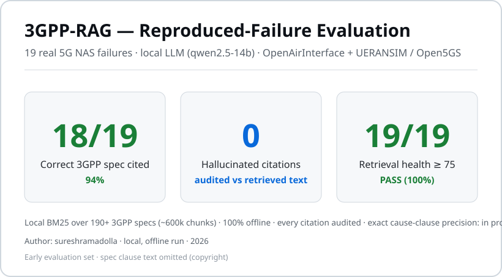
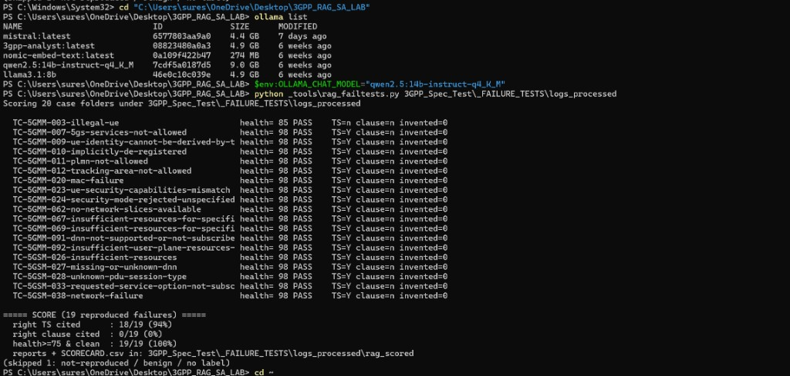
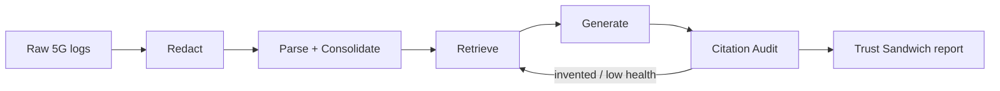

# 3GPP-RAG

### Offline, Spec-Grounded RAG for 5G Failure Analysis — Every Answer Cited to a 3GPP Clause


-orange)


---

## Table of Contents

1. [Overview](#overview)
2. [Live Demo](#live-demo)
3. [Project Structure](#project-structure)
4. [Key Findings](#key-findings)
5. [Project Report](#project-report)
6. [Pipeline Stages](#pipeline-stages)
7. [Tech Stack](#tech-stack)
8. [Installation & Local Setup](#installation--local-setup)
9. [Spec Index & Data](#spec-index--data)
10. [Local Model (Ollama)](#local-model-ollama)
11. [Running Offline](#running-offline)
12. [.gitignore Recommendations](#gitignore-recommendations)
13. [License](#license)
14. [Author](#author)

---

## Overview

**3GPP-RAG** turns a 5G signalling failure into a spec-grounded root-cause explanation — running
**entirely offline**, with **every claim tied to a specific 3GPP clause** and **every citation audited**
against the retrieved text.

The motivation is two hard problems. First, large language models hallucinate — a confident but
made-up "cause" or clause reference is worse than no tool, because it sends an engineer the wrong way.
Second, signalling logs carry subscriber, device, and operator identifiers, so they can't be sent to a
cloud service. 3GPP-RAG answers both: the **specification is the source of truth**, not the model's
memory, and **nothing leaves the machine**.

**Who it's for:**

- **RAN / Core engineers** — spec-grounded root-cause for NAS / RRC / NGAP failures, cited to the clause.
- **ML / AI engineers** — a working citation-audit + self-correction RAG pattern that runs fully offline.
- **Hiring managers** — an end-to-end system: redact → parse → retrieve → generate → audit → report, validated on real reproduced failures.

**Key capabilities:**

| Capability | Details |
|---|---|
| 🔒 **Offline by design** | Logs, spec index, model, and inference are all local — runs with the network off. |
| 📚 **Spec-grounded** | BM25 retrieval over a local index of 3GPP specs; answers are built from retrieved clauses, not model memory. |
| ✅ **Citation-audited** | Every cited `TS / §` is checked against retrieved text; anything unbacked is flagged as *invented*. |
| 🔁 **Self-correcting** | Re-searches and regenerates on low retrieval health or an invented citation. |
| 🛡️ **Confidentiality-first** | Subscriber / device / operator identifiers are stripped before anything is analysed. |

---

## Live Demo

> 🔌 **No hosted demo — 3GPP-RAG runs locally, offline by design.**

| Asset | Location |
|---|---|
| **Results scorecard (SVG)** | [`media/results-card.svg`](media/results-card.svg) |
| **Eval run screenshot** | [`media/rag-failtests-scorecard.png`](media/rag-failtests-scorecard.png) |
| **Example case (sanitized)** | [`examples/TC-5GMM-011-plmn-not-allowed/`](examples/TC-5GMM-011-plmn-not-allowed/) |
| **More media** | [`media/`](media/) |

<!-- Optional: uncomment when you add a demo GIF

-->

---

## Project Structure

```
3GPP-RAG/
├── README.md                 # This file
├── ARCHITECTURE.md           # Design, stage by stage
├── ROADMAP.md                # Proven / in-progress / next
├── LICENSE
├── .gitignore
├── docs/
│   └── DESIGN_NOTES.md       # Build story & rationale
├── examples/
│   └── TC-5GMM-011-plmn-not-allowed/
│       ├── LABEL.txt         # Answer key (cause + clause)
│       └── REPORT.md         # Trimmed Trust Sandwich report
└── media/
    ├── results-card.svg              # Evaluation scorecard (SVG)
    ├── rag-failtests-scorecard.png   # Eval run terminal screenshot
    └── README.md                     # Media usage notes
```

> **This is a public showcase — design, documentation, and results only.** The implementation source
> is **private** and not included here; it is available to reviewers **on request**.

---

## Key Findings

> All metrics are from **real failures reproduced** in open-source 5G labs (OpenAirInterface + UERANSIM / Open5GS), scored with a **local LLM** (Qwen 2.5 14B via Ollama).





| Metric | Value |
|---|---|
| **Reproduced failures evaluated** | **19** (L3 NAS — 5GMM + 5GSM) |
| **Correct specification cited** | **18 / 19 (94%)** |
| **Correct clause cited** | **0 / 19 (0%)** |
| **Hallucinated citations** | **0** |
| **Retrieval health ≥ 75 & clean** | **19 / 19 (100%)** |
| **Skipped (not reproduced / benign / no label)** | **1** |
| **Local spec index** | 190+ 3GPP specifications · ~600k chunks |

> An early, deliberately small evaluation set — treated as a signal, not a headline. Spec-level
> citation is strong; **clause-level precision is the next gap to close**. Broader coverage
> (214 failure test cases) is in progress. See [`ROADMAP.md`](ROADMAP.md).

### Evaluation run

| Field | Value |
|---|---|
| **Date** | August 2026 |
| **Command** | `python _tools\rag_failtests.py 3GPP_Spec_Test\_FAILURE_TESTS\logs_processed` |
| **Model** | `qwen2.5:14b-instruct-q4_K_M` via Ollama |
| **Cases scored** | 19 reproduced failures (1 skipped) |
| **Typical per-case health** | 98 PASS · TS=Y · invented=0 |
| **Evidence** | [`media/rag-failtests-scorecard.png`](media/rag-failtests-scorecard.png) |

### Validation method (closed loop)

| Step | What happens |
|---|---|
| 1. **Test-case suite** | One failure per 3GPP cause code, each with an answer key (cause + governing clause). |
| 2. **Fault injection** | Wrong PLMN, unknown DNN, MAC failure, missing slice, etc. on a live open-source stack. |
| 3. **Reproduction gate** | Case counts only if the signature appears in the decoded capture. |
| 4. **Decode → redact → analyse** | Signalling is parsed, identifiers stripped, failure handed to 3GPP-RAG. |
| 5. **Automated scoring** | Answer checked against the answer key — cause, clause, invented citations. |

**Lab stack (Ubuntu VM):** UERANSIM · Open5GS · OpenAirInterface · tshark / Wireshark

---

## Project Report

Detailed design, validation methodology, and roadmap:

| Document | Description |
|---|---|
| 🔗 **[Architecture](ARCHITECTURE.md)** | Full pipeline: redact → parse → retrieve → generate → audit → Trust Sandwich |
| 🔗 **[Roadmap](ROADMAP.md)** | What is proven, in progress, and planned next |
| 🔗 **[Design notes](docs/DESIGN_NOTES.md)** | Build story and engineering rationale |
| 🔗 **[Example case](examples/TC-5GMM-011-plmn-not-allowed/REPORT.md)** | Sanitized TC-5GMM-011 — PLMN not allowed (#11) |

---

## Pipeline Stages

Each stage has one job. Trust guarantees come from **deterministic** stages and the **audit** — not from asking a model to behave.



### 1. 🔒 Redact
Strips subscriber / device / operator identifiers first — deterministic and idempotent. Nothing sensitive proceeds downstream.

### 2. 🧩 Parse + Consolidate
Decodes signalling into per-message events and per-UE timelines. Protocol, message, and cause are decoded **deterministically** — not guessed.

### 3. 🔎 Retrieve
BM25 over a local SQLite FTS5 index of 3GPP specs, with telecom synonym expansion, filtered to the governing spec.

### 4. 🧠 Generate
A local model (via Ollama) explains the failure using **only** retrieved clauses. If the model is unreachable, it degrades to a grounded **extractive** summary — it never fabricates.

### 5. ✅ Citation Audit
Every cited `TS / §` is checked against retrieved text. Backed citations are **VERIFIED**; anything else is **INVENTED**.

### 6. 🔁 Self-Correction
On an invented citation or low retrieval health, the system re-queries with refined terms and regenerates, keeping the best-grounded result.

### 7. 🥪 Trust Sandwich Report
Retrieval-health score (PASS / FLAG), grounded analysis, and full citation audit — the final engineer-facing output.

---

## Tech Stack

| Technology | Purpose | Version |
|---|---|---|
| **Python** | Core language | 3.10+ |
| **Ollama** | Local LLM runtime (Qwen 2.5, Llama 3.1, custom Modelfile) | latest |
| **SQLite FTS5** | Local spec index + BM25 retrieval | 3.x |
| **FastAPI / uvicorn** | OpenAI-compatible RAG bridge API | latest |
| **tshark / Wireshark** | Signalling decode | latest |
| **OpenAirInterface · UERANSIM · Open5GS** | Open-source 5G stacks for reproducing failures | latest |

---

## Installation & Local Setup

> For reference only — full scripts ship with the **private source** (available on request). This showcase repo contains **documentation and results only**.

### Prerequisites

- Python 3.10 or higher
- [Ollama](https://ollama.com) installed, with a local instruct model pulled
- 3GPP specifications (obtained yourself from official 3GPP / ETSI portals) to build the local index
- Ubuntu VM (optional) for open-source 5G lab captures — OAI / UERANSIM / Open5GS

### Steps

```bash
# 1. Clone this showcase repository
git clone https://github.com/sureshramadolla428/3gpp-rag.git
cd 3gpp-rag

# 2. Read the architecture and example case
#    ARCHITECTURE.md  — pipeline design
#    examples/TC-5GMM-011-plmn-not-allowed/  — sanitized real failure

# 3. (With private source access) create a virtual environment
python -m venv .venv
source .venv/bin/activate          # Windows: .venv\Scripts\activate

# 4. Install dependencies and build the local spec index
#    (indexing scripts ship with the private toolkit — see ROADMAP.md)

# 5. Start Ollama + RAG bridge, then query
#    Ollama:  http://127.0.0.1:11434
#    Bridge:  http://127.0.0.1:8000
```

> ⚠️ **Never commit the spec index, captured logs, or subscriber content.** See
> [.gitignore Recommendations](#gitignore-recommendations).

---

## Spec Index & Data

| Property | Detail |
|---|---|
| **Source** | 3GPP / ETSI specifications (obtained by you from official portals) |
| **Index format** | SQLite FTS5 — BM25 over ~600k chunks |
| **Coverage** | 190+ TS/TR documents (NAS, RRC, NGAP, core, NTN, …) |
| **Shipped in this repo?** | **No** — index and spec text are never committed (copyright + size) |
| **Captured logs / pcaps?** | **No** — only sanitized example outputs in `examples/` |

> ⚠️ **Do NOT commit `*.db`, pcaps, or raw logs.** Add `data/`, `*.db`, and `Logs_*/` to your `.gitignore`.

---

## Local Model (Ollama)

3GPP-RAG uses a **local** model through Ollama — no API keys, no cloud, no "OpenAI API" in production.

```bash
# Install a local instruct model (either works)
ollama pull llama3.1:8b
# or
ollama pull qwen2.5:14b-instruct

# Verify Ollama is running
curl http://127.0.0.1:11434/api/tags
```

| Setting | Typical value |
|---|---|
| **Ollama URL** | `http://127.0.0.1:11434` |
| **RAG bridge URL** | `http://127.0.0.1:8000` |
| **Bridge API model id** | `3gpp-rag` (OpenAI-compatible `/v1/chat/completions`) |

If the model is offline, 3GPP-RAG degrades to a grounded **extractive** answer (retrieved clauses only) rather than inventing — so the output stays safe.

> **Note:** Optional chat UIs (e.g. Open WebUI in Docker) may label a connection "OpenAI API" — that only means *OpenAI-compatible protocol*. Traffic stays on `localhost`; nothing is sent to OpenAI's cloud.

---

## Running Offline

Everything — redaction, parsing, the BM25 index, the model, and inference — runs on one machine. Disconnect the network entirely and it still works. For telecom data, that isn't a limitation to apologise for; it's the requirement.

**Typical daily startup (Windows workstation):**

1. Start **Ollama** → verify `http://127.0.0.1:11434/api/tags`
2. Start **RAG bridge** → verify `http://127.0.0.1:8000/health` (`chunk_count` ~600k+)
3. Query via PowerShell, bridge `/docs`, or optional local WebUI on a free port (e.g. `:8088` if `:3000` is Grafana)

---

## .gitignore Recommendations

Add the following to avoid committing sensitive or large files:

```gitignore
# Spec index & any database (would contain copyrighted 3GPP text)
*.db
*.db-shm
*.db-wal
data/
**/spec_index*

# Captured logs / traces / decodes
logs/
Logs_*/
**/pcaps/
*.pcap
*.pcapng
*.log
*.dat

# Site-specific / sensitive config
vendor_terms.txt
.env

# Python / OS cruft
__pycache__/
*.pyc
.venv/
venv/
.DS_Store
Thumbs.db
```

---

## License / Rights

All Rights Reserved. This public repository is a showcase; see LICENSE. No permission is granted to use, copy, modify, or distribute any part of this repository without prior written consent.

## Author

Created by **[sureshramadolla428](https://github.com/sureshramadolla428)**

---

*Built to be trustworthy, not just fluent — offline, spec-grounded, and citation-audited.*

